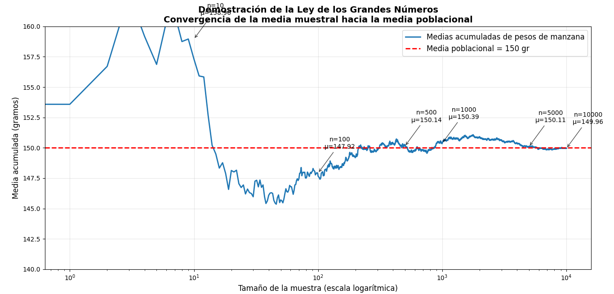
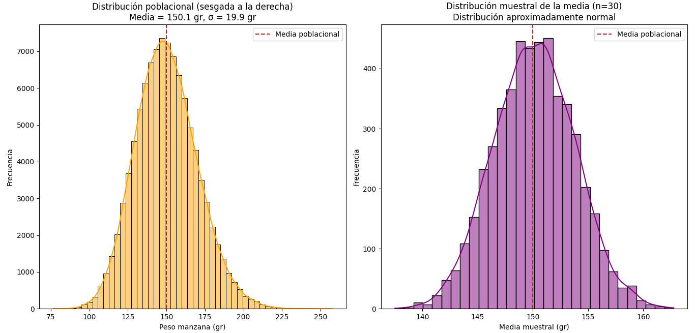

# 📈 Estadística Inferencial

Este módulo contiene dos ejercicios fundamentales para comprender los pilares de la estadística inferencial: la **Ley de los Grandes Números** y el **Teorema del Límite Central**. Ambos se desarrollan mediante simulaciones en Python y se acompañan de visualizaciones que ilustran los conceptos de forma intuitiva.

---

## 🧮 Ley de los Grandes Números

La Ley de los Grandes Números establece que, al aumentar el tamaño de la muestra, el promedio muestral tiende a acercarse al valor esperado de la población. En este ejercicio se simula el lanzamiento repetido de una variable aleatoria para observar cómo converge la media.

### 📷 Visualización

### 🔍 Objetivos del ejercicio

- Simular una variable aleatoria con distribución conocida.
- Calcular la media muestral acumulada a medida que aumenta el tamaño de la muestra.
- Visualizar la convergencia hacia el valor esperado.
- Interpretar el comportamiento de la media en función del tamaño muestral.

---

## 📊 Teorema del Límite Central

El Teorema del Límite Central afirma que, al tomar muchas muestras de una población (independientemente de su distribución original), la distribución de las medias muestrales tiende a una distribución normal, especialmente cuando el tamaño de la muestra es suficientemente grande.

### 📷 Visualización

### 🔍 Objetivos del ejercicio

- Generar una población con distribución no normal (por ejemplo, uniforme o exponencial).
- Extraer múltiples muestras aleatorias de tamaño fijo.
- Calcular la media de cada muestra.
- Visualizar la distribución de las medias muestrales y su aproximación a la normalidad.

---

## 🧠 Reflexión

Estos ejercicios permiten observar empíricamente dos principios clave que sustentan la inferencia estadística. Comprenderlos es esencial para interpretar resultados de muestras, construir intervalos de confianza y aplicar pruebas estadísticas con fundamento.

---

## 📁 Estructura del directorio
